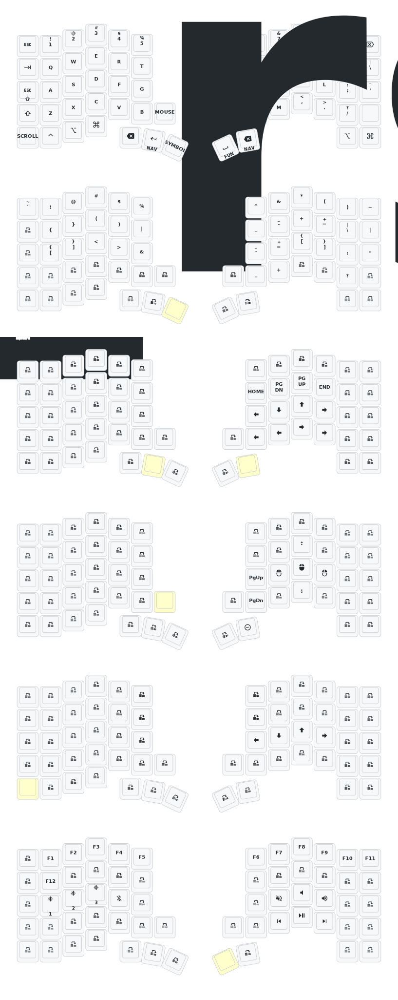

# Keyball61 ZMK Config

ZMK firmware configuration for the Keyball61 split keyboard with integrated trackball.

## Features

- **Home row mods** (CAGS order) with cross-hand activation for macOS
- **Miryoku-inspired symbol layer** with brackets on home row
- **Auto-mouse layer** with trackball movement detection
- **Scroll layer** with arrow keys and page navigation

## Keymap

## Build

Firmware is built automatically via GitHub Actions on push to `main`. The keymap image above is also auto-generated.

## Credits

PCB: *[yangxing844](https://github.com/yangxing844)*
Case: *[delock](https://github.com/delock)*
Firmware: *[Amos698](https://github.com/Amos698)*
